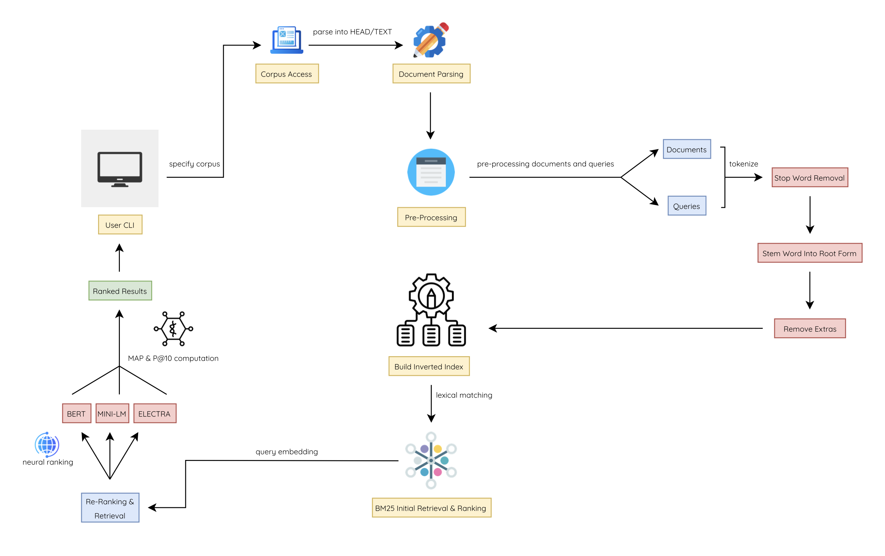

# Yoogle 🔍

Yoogle (Yash + Google) is a neural information retrieval system inspired by Google’s search engine. It uses BM25 for fast initial retrieval, implements neural word embeddings for richer semantic representations, and then refines results with three advanced transformer models BERT, MiniLM and ELECTRA. By mimicking Google’s two‑stage approach (fast lexical matching followed by deep semantic ranking), Yoogle delivers highly precise and relevant results.

# Running Instructions 🏎️
Dependencies Required:
- python3
- nltk
- tensorflow
- pytrec_eval

Execution:
1. Change directory to `IR_Files`
2. Run `python3 main.py` for TITLE + TEXT || Run `python3 main_head.py` for TITLE

# Details ⚙️
Yoogle’s pipeline begins by parsing documents and queries into structured tokens, then preprocessing (documents & queries) with tokenization, normalization and embedding generation. During indexing, an inverted index is built that maps each normalized term to its list of documents for lightning‑fast lookup, alongside a neural vector store of embeddings. At query time, BM25 retrieves candidate documents which are then re‑ranked using transformer‑based similarity scoring from different models such as BERT, MINI LM, and ELECTRA.

# Architecture 🛠️
Please see the system's design and architecture below:

# Results 📝
MiniLM proved both the fastest and most accurate among all neural models, achieving a mean average precision (MAP) of 0.63—indicating that, on average, 63% of retrieved documents were relevant.

# Conclusion 🙌
In conclusion, Yoogle shows how combining a fast BM25 retrieval stage with neural word embeddings and transformer‑based re‑ranking using BERT, MiniLM and ELECTRA can produce highly precise and relevant search results. This two‑stage design mirrors modern search engines (such as Google) and lays the groundwork for further enhancements in model variety and indexing efficiency.