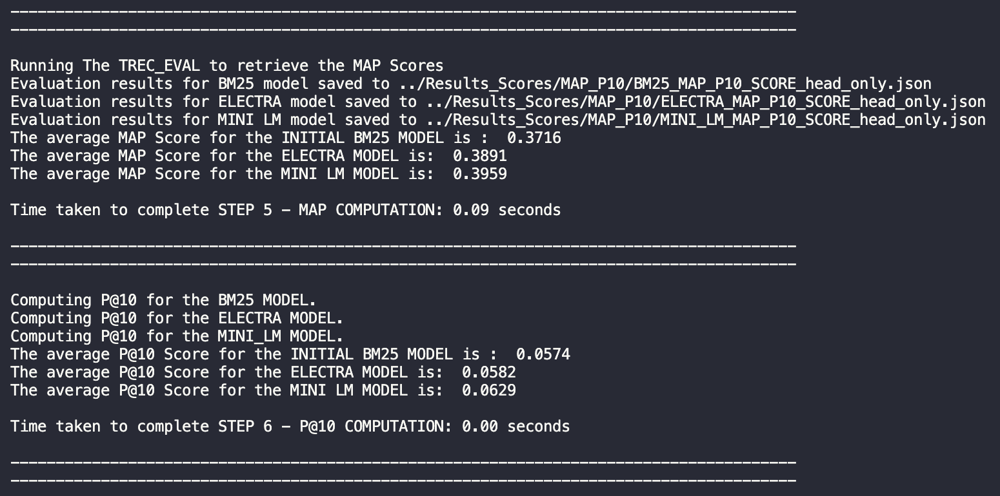
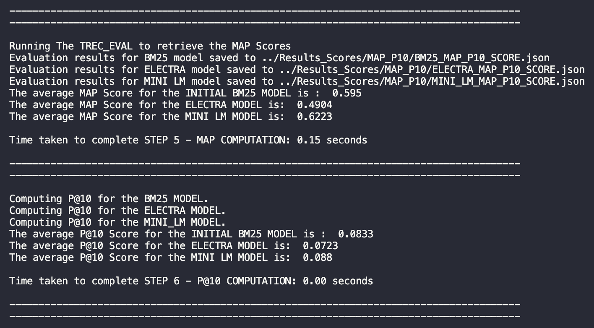

# Submission Details 📖

## Students Information: 📖
- Yash Jain : 300245571
- Tolu Emoruwa : 300230905
- Shacha Parker : 300235525

## Dividing Tasks Information: 📒
1. Yash Jain's Work... 📕
- Implemented the MINI_LM model
- Computed P@10 Scores, final timings, and MAP scores
- Organized directories
- Implemented parts of Neural Ranking (neural_ranking.py)
- Implemented CustomReranker (customizer.py)
- Researched different models for MINI_LM (SentenceTransformers)
- Documentation of code and program
- Created TOP 10 documents FIRST 2 queries for all models (STEP 7)
- Implemented, ran, and evaluated the TITLE vs TEXT/TITLE for all models

2. Tolu Emoruwa's Work... 📗
- Created the base framework for all models to work
- Implemented parts of Neural Ranking (neural_ranking.py)
- Ran final program to ensure everything works and is submission ready
- Researched different models for BERT, MINI LM, and ELECTRA and understood difference of SentenceTransformers vs CrossEncoders
- Decided final models to implement for fast processing times + higher scores
- Documentation of code and program
- Researched RERANKING process use case of CrossEncoders
- Wrote explaination of final results (understanding as to why some models score higher than others)

3. Shacha Parker's Work... 📙
- Implemented the ELECTRA model
- Researched different models for ELECTRA (CrossEncoders)
- Ran final program to ensure everything works and is submission ready
- Worked on implementing BERT with WEIGHTS
- Implemented parts of Neural Ranking (neural_ranking.py)
- Documentation of code and program
- Researched RERANKING process use case of CrossEncoders
- Implemented framework for TITLE vs TITLE/TEXT 

## Running Instructions: 📓
Ensure the following is installed:
- Python Version on the host machine
- NLTK
- Tensorflow
- PYTREC_Eval
- Other missing dependencies that may arise/occur when mentioned in the terminal during the execution of the program

For execution:
1. Navigate to the `IR_Files` subfolder
2. Run the command `python3 main.py` or `python main.py` if you do not have Python 3 installed, but another version

## Functionality Of Program & Explaination Of Algorithms: 🔍
The `main.py` file contains our main program which is used for running the code. It does the following
- Sets the file paths
- Completes Step 0 (basically the code inside `parser.py` file) and calculates the time to do so
- Completes Step 1 (basically the code inside `preprocessor.py` file) and calculates the time to do so
- Completes Step 2 (basically the code inside `indexing.py` file) and calculates the time to do so
- Completes Step 3 (getting document lengths)
- Completes Step 4.0 (computation of the BM25 model which is our initial model)
- Completes Step 4.1 (computation of the ELECTRA model)
- Completes Step 4.2 (computation of the MINI LM model)
- Completes Step 5 (computing MAP scores through PYTREC_EVAL)
- Completes Step 6 (computing P@10 scores through PYTREC_EVAL)
- Completes Step 7 (retrieving TOP 10 DOCUMENTS FIRST 2 QUERIES for all models)

The `utils.py` file contains our utilities which is used for running the code. IT...
- This is a helper file that is used within `main.py` it creates progress bars for visualization in the terminal
- This file also has the `writeResults()` function which retrieves the top 1 score for the document for the specific associated query and writes the results to an output file called ***TopScoresAllQueries.txt***
- This file also has the `writeResultsTop10First2()` function which retrieves the top 10 scores for the document for the first 2 specific associated queries and writes the results to an output file called ***Top10AnswersFirst2Queries.txt***
- This file also has the `writeResultsAll()` function which retrieves all the scores for the document for all the specific associated queries and writes the results to an output file called ***AllScoresAllQueries.txt***
- This file also has the `writeResultsTop100()` function which retrieves the top 100 scores for the document for all the specific associated queries and writes the results to an output file called ***Results.txt***

### 0. Step Zero Implementation (Parsing) ⚖️
This step has it's functions and associated code within the parser.py file. This parser.py contains the 4 functions which help parse documents from the file (and this calls the document parsing function). It also helps parse queries from the file (and this calls the query parsing function). In essence, the purpose of this file is to read the JSON and extract information for both corpus.jsonl (documents) and queries.jsonl (queries). The data structures and algorithms used in this step are simple hashmaps that seperate the actual document number, title of the text, and the actual text body into 3 seperate keys, this is for documents. For queries, again another hashmap is used to seperate the query number and query title as keys.

This steps is before/mixed within the preprocessing (Step 1). The associated code for this step can be seen in the `parser.py` file.

### 1. Step One Implementation (Preprocessing) 🔬
Preprocessing is implemented through 2 steps (preprocessing documents) and (preprocessing queries) and is completed within the `preprocessing.py` file. This file has all the associated code and functions to complete the preprocessing step. The 2 seperate steps are highlighted below:

### 1.1 Preprocessing Documents 🔭
This step is for preprocessing documents and it is done by a few functions. In essence, we leverage a hashmap to extract the specific details about the document such as the title (which represents the HEAD key in the hashmap) and the body text (which represents the TEXT key in the hashmap). From here we simply preprocess the text within the hashmap and this includes the process of ***tokenization*** and ***stemming***. In tokenization, we utilize a regex to ensure that only alphabets are allowed, (this removes unnecessary text such as brackets, dashes, numbers, etc.). From here, we also leverage the stopWords.txt file which contains all the stopWords. We filter out any stop words from the documents. The stemming process simply utilizes a ***PorterStemmer()*** to reduce words to their root form and improve text normalization. This includes all the filtration, and from here we simply return the documents which are now cleaned and validated.

### 1.2 Preprocessing Queries 🔭
- This step is for preprocessing queries and it is done by the same similar process in which documents were validated. In a quick short summary, we leverage a hashmap to extract the specific text for the query which is simply stored as the title key. Note: We do not include the query number! Otherwise, this will filter out our queries incorrectly, and cause wrong results, as numbers are filtered returning invalid key values inside the hashmap. From there we simply, preprocess the text within the query which is the same process as preprocessing the text for documents (***tokenizing it and usage of stemmers***). We then return after all the filtration as the queries are now cleaned and validated.

This step's output is stored across 2 files and in here you can see the cleaned and validated files with stopWords removed and words that are stemmed as well as seperate entities (title and text) stored in (HEAD and text). The files are listed as below:
- `Results_Scores/Building/preprocessed_documents.json` (in the .gitignore because too large and can't push to github)
- `Results_Scores/Building/preprocessed_queries.json` (in the .gitignore because too large and can't push to github)

### 2. Step Two Implementation (Indexing) 🛠️
In this step we start to build our inverted index from the cleaned and validated documents from STEP 1. We leverage a hashmap that efficiently maps each unique token to the documents in which it appears, along with the frequency of its occurrences. The `build_inverted_index` function constructs this index by iterating through the provided documents, ensuring quick lookup and retrieval of term-document associations. Additionally, the `calculate_document_lengths` function computes the length of each document, which is used when computing the BM25 score for ranking and retrieval. The process is done inside `indexing.py` and the output from this step can be seen in `Results_Scores/Building/inverted_index.json` (in the .gitignore because too large and can't push to github).

### 3. Step Three Implementation (Ranking & Retrieval) 🏆
In this step, we use our inverted index from STEP 2 to complete the ranking, scoring, and retrieval process much more ***efficiently***. With the `inverted_index`, we compute the document length as said before, which will be needed for the ***BM25 ranking score algorithm***. We then start our ranking process, which utilizes the BM25 ranking score algorithm to determine the most relevant documents for a given query. The BM25 ranking function assigns scores to documents based on term frequency, inverse document frequency, and document length normalization. Using the `BM25` class, we compute the **Inverse Document Frequency (IDF)** for each query term, ensuring that less frequent terms contribute more to the ranking. The **Term Frequency (TF)** component is adjusted using the `k1` (k1 value is 1.5) and `b` (b value is 0.75) parameters to balance term importance while considering document length. Once we have computed the BM25 scores for all relevant documents, we sort them in descending order to present the most relevant results first. Additionally, we apply a **score normalization function**, ensuring that the ranking values are scaled between 0 and 1, making them easier to interpret.

This step's output is stored in the `Results_Scores/BM25/TopScoresAllQueries.txt` file and here you can see our final results. The associated code and functions for this step can be seen in the `ranking.py` file. This step also creates 2 more files `Results_Scores/BM25/Top10AnswersFirst2Queries.txt` which is our top 10 scores for the first 2 queries and `Results_Scores/BM25/AllScoresAllQueries.txt` which is our scores for all queries. Lastly, this step creates the final results file as well in the `Results_Scores/BM25/Results.txt` which contains the top 100 document scores for the queries. This `Results_Scores/BM25/Results.txt` is the file we use in our PYTREC_EVAL to retrieve the MAP Score and compare it against test.tsv. We skip the first 80735 lines to ensure we only get queries that are apparent in the test.tsv file, i.e. the test queries.

The same is done for the ELECTRA, and MINI_LM model.

### 3.1 Justification of BM25 Algorithm Over Cosine Simularity ✏️
We decided to leverage the BM25 Algorithm because it has a higher retrieval performance and also lead to faster processing times. When we implemented the COSINE SIM ranking algorithm, our code took around ~15-30 minutes to run. With the BM25 algorithm, our code was processed within seconds, thus we decided to finalize on the BM25 Algorithm and neglect the COSINE SIM algorithm.

## Mean Average Precision (MAP) Score: 📊
Our models have varying MAP scores. Please refer to the stats below:
- BM25 : 0.595 `Results_Scores/MAP_P10/BM25_MAP_P10_SCORE.json`
- ELECTRA : 0.4904 `Results_Scores/MAP_P10/ELECTRA_MAP_P10_SCORE.json`
- MINI_LM : 0.6223 `Results_Scores/MAP_P10/MINI_LM_MAP_P10_SCORE.json`

Scores can be found in there associated files.

## P@10 Score: 📊
Our models have varying P@10 scores. Please refer to the stats below:
- BM25 : 0.0833 `Results_Scores/MAP_P10/BM25_MAP_P10_SCORE.json`
- ELECTRA : 0.0723 `Results_Scores/MAP_P10/ELECTRA_MAP_P10_SCORE.json`
- MINI_LM : 0.088 `Results_Scores/MAP_P10/MINI_LM_MAP_P10_SCORE.json`

Scores can be found in there associated files.

## Comparing Results (Title VS Title + Text) 🆚
TITLE ONLY - MAP & P@10
- BM25 MAP = 0.3716
- BM25 P@10 = 0.0574

- ELECTRA MAP = 0.3891
- ELECTRA P@10 = 0.0582

- MINI_LM MAP = 0.3959
- MINI_LM P@10 = 0.0629

TITLE + TEXT - MAP & P@10
- BM25 MAP = 0.595
- BM25 P@10 = 0.0833

- ELECTRA MAP = 0.4904
- ELECTRA P@10 = 0.0723

- MINI_LM MAP = 0.6223
- MINI_LM P@10 = 0.088

The code needed to change the program to preprocess only the head text without the body is found in `main.py`. Searching the document for "head_only" will show three lines that have been commented out. If you un-comment them and comment out the original functions, it'll run preprocessing with only the head text.

NOTE: All TITLE only files have the same format as their counterparts with TITLE + TEXT, and can be found/seen with the "_head_only" text added at the end.

Please see the image below to refer to an example run. This is for the TITLE ONLY.

Please see the image below to refer to an example run. This is for the TITLE + TEXT.

After analyzing, these results it's clear that TITLE + TEXT generally retrieves higher scores in terms of MAP + PRECISION. Using the full set of data with text, allows better retrieval and context gathering for the model, as they have more information to work with. If you see the `Sample100Vocabulary_head_only.txt` you can see that there is limited information to be gathered only from the TITLE. This file shows a sample of 100 vocabulary with head only.

## Discussion Of Results (How Big Was The Vocabulary, Sample 100 Vocabulary and Top 10 Answers First 2 Queries) 📚
The vocabulary (documents after being preprocessed) was 5183 in length representing the fact that there are 5183 documents, each with their own HEAD (title of the text) and TEXT (body of the text) keys.

We included a sample of the first 100 documents, this can be seen in the file `Sample100Vocabulary.txt`, found in the `Building/` folder. Each document is represented by a specific document number (which then has HEAD for titles, and TEXT for body text). Analysis and discussion of these results can be seen in the next section:

In addition, we included the first 10 answers for the first 2 queries for all models in files found in the `TOP_10_DOCS_FIRST_2_QUERIES` folder.

### First Query Top 10 Answers 1️⃣
Analyzing the first query, we see that it is for query 0. The matching document that was returned with a score of 1, was actually DOCNO 26071782. This means that there were similar words from this document and matching query. Upon further digging we see that this query has words seen below:

{
    "num": "0",
    "title": [
        "dimension",
        "biomateri",
        "lack",
        "induct",
        "properti"
    ]
} ***from `preprocessed_queries.json`***

Words such as inductive and properties (can be seen ***from `queries.jsonl`***) are reduced to their stemmed and original rooted form. Now analyzing the highest document we see that the document 26071782 indeed does not only have these occurences of the words, but a lot of occurences of these words in the document.

Analyzing the 10th document we see that it is document 7581911 and it has a relevance score of 0.5167142311126022 with this query. Upon further analysis of this document we do indeed see occurences of some words such as biomateri, induct, and properti, however not too many, thus resulting in a lower score.

### Second Query Top 10 Answers 2️⃣
Analyzing the second query, we see that it is for query 2. The matching document that was returned with a score of 1, was actually DOCNO 13734012. This means that there were similar words from this document and matching query. Upon further digging we see that this query has words seen below:

{
    "num": "2",
    "title": [
        "uk",
        "abnorm",
        "prp",
        "posit"
    ]
} ***from `preprocessed_queries.json`***

Words such as abnormal and positivity (can be seen ***from `queries.jsonl`***) are reduced to their stemmed and original rooted form. Now analyzing the highest document we see that the document 13734012 indeed does not only have these occurences of the words, but a lot of occurences of these words in the document. Not to mention the texts are highly related in subject matter, as the text discusses how samples tested *positive* for *abnormal* *PRP* protein levels in 41 *UK* patients!

Analyzing the 10th document we see that it is document 4828631 and it has a relevance score of 0.12895936091854868 with this query. Upon further analysis of this document we do indeed see extremely low occurences of the words. Hence the low score! It discusses UK Adults but nothing about abnormality, sample positivity, and PRP levels.

We do indeed so how our IR system is accurate!

## Files Included In The .gitignore ⚙️
We have a few files in the .gitignore:
- DS._STORE (MAC OS File)
- Results_Scores/Building/inverted_index.json (too large cannot push to github)
- Results_Scores/Building/preprocessed_documents.json (too large cannot push to github)
- Results_Scores/Building/preprocessed_queries.json (too large cannot push to github)
- Results_Scores/BM25/AllScoresAllQueries.txt (too large cannot push to github)
- IR_Files/__pycache__/ (not needed)

## Evaluation & Explaination of Model Performance 🏎️
Our model performance in order is the following:
1. MINI LM
2. BM25
3. ELECTRA

As you can see with the MINI LM we scored the highest P@10 & MAP score with a final result of around 0.62-0.63, which is roughly a 0.4 increase from the initial BM25 model implemented in A1. The original MAP score was 0.59.

While other models such as the ELECTRA actually caused lower scores, and caused the MAP score to drop after reranking. Specifically speaking, ELECTRA resulted in a MAP score of ~0.47.

We also wanted to quickly highlight running times for all of our models. On a 2021 Macbook Pro with an Apple M1 Pro Chip with 16 GB in RAM, the following times were achieved for TITLE:
1. MINI LM = ~1 minute
2. BM25 = ~10 seconds
3. ELECTRA = ~3 minutes

We also wanted to quickly highlight running times for all of our models. On a 2021 Macbook Pro with an Apple M1 Pro Chip with 16 GB in RAM, the following times were achieved for TITLE + TEXT:
1. MINI LM = ~9 minutes
2. BM25 = ~20 seconds
3. ELECTRA = ~1.5 hour

Now discussing model performance, we evaluated and highlighted that the MINI LM outperformed others due to its efficient, lightweight architecture that captures nuanced semantic relationships exceptionally well, enabling it to deliver higher precision at top ranks and an improved MAP score while significantly reducing computational overhead compared to models like ELECTRA. Furthermore MINI LM was implemented with weighting which played a major factor in retrieving higher scores.

We evaluated that ELECTRA caused lower scores because their cross encoder implementations, while theoretically capable of capturing intricate semantic nuances by jointly processing query-document pairs, introduced substantial computational complexity and were more prone to overfitting on our limited training data. This led to inefficient generalization across diverse queries and ultimately diminished the ranking performance compared to more optimized and lightweight models like MINI LM. Furthermore, it is hard for these models to rerank with only 100 documents to work with, because the initial results were used from the IR system.

We also noticed that the initial model was still quite strong—BM25 is generally a strong algorithm, so its robust performance underscores the enduring effectiveness of traditional retrieval techniques. Despite the advances seen with neural models, BM25’s efficient term weighting and inverse document frequency calculations continue to deliver competitive baseline results. This resilience makes it an indispensable starting point, especially when computational resources are constrained or when used in conjunction with re-ranking strategies such as cross encoders, which can further refine results without entirely replacing the foundational BM25 retrieval.

Furthermore, we also wanted to highlight an interesting result we noticed. In our TITLE only implementation/run we saw that the ELECTRA model actually scored higher than the BM25 model. Which is particularly, interesting because for the TITLE + TEXT it scored lower. This goes to show that model performance is highly context-dependent—while ELECTRA's deep semantic understanding shines with concise inputs like titles, traditional term-based methods like BM25 can leverage the additional context provided by full-text data to improve retrieval accuracy. With the TEXT implementation BM25 was able to leverage that and in the end score an overall higher result.

Overall, the best performing model given the context of only TITLES, and even TITLES/TEXT was the MINI_LM. This model leverages weights, and also in terms of time/speed performs relatively well. While BM25, is still the fastest, it is no longer the best, as MINI_LM outshines it, with fast speed and higher accuracy.

## Conclusion 🌴
In this assignment, we created an IR System with different neural models. We leveraged Python, built in libraries, specific data structures and algorithms, SentenceTransformers, BEIR Framework, as well as the BM25 ranking algorithm as our BASE.

In our report, we see that our IR System is quite accurate with a high mapping score, and documents that have high scores with their associated queries are indeed related.

In conclusion, our highest performing model was the MINI LM model as it leverages weights and is able to capture more nuanced semantic relationships.

## References/Works Cited 📝
Connelly, S. (2024, September 13). Practical BM25 - part 2: The BM25 algorithm and its variables. Elastic Blog. https://www.elastic.co/blog/practical-bm25-part-2-the-bm25-algorithm-and-its-variables

Cross-Encoders — Sentence Transformers  documentation. (n.d.). Retrieved March 27, 2025, from https://www.sbert.net/examples/applications/cross-encoder/README.html

SentenceTransformers Documentation — Sentence Transformers  documentation. (n.d.). Retrieved March 27, 2025, from https://sbert.net/

sentence-transformers/all-MiniLM-L6-v2 · Hugging Face. (n.d.). Retrieved March 27, 2025, from https://huggingface.co/sentence-transformers/all-MiniLM-L6-v2

YILMAZ,  &Ouml;mer. (2024, February 27). Mastering stemming algorithms in Natural Language Processing: A complete guide with python... Medium. https://medium.com/@omrylmzz35/mastering-stemming-algorithms-in-natural-language-processing-a-complete-guide-with-python-e7fd12089a69